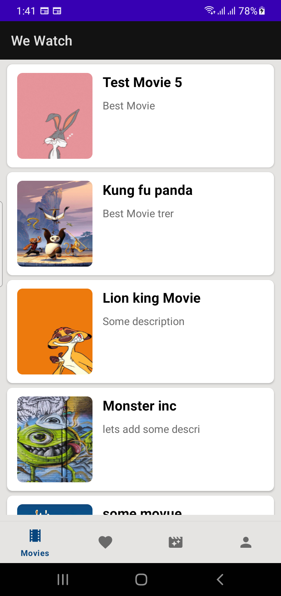
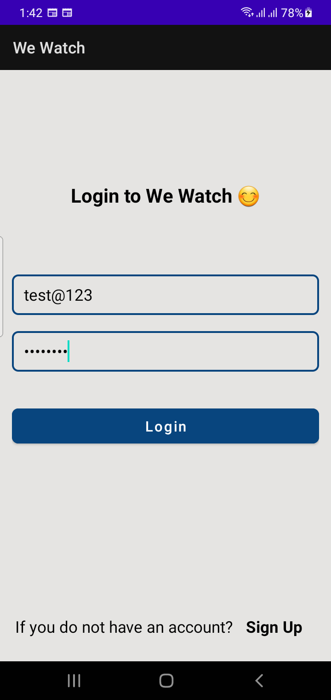
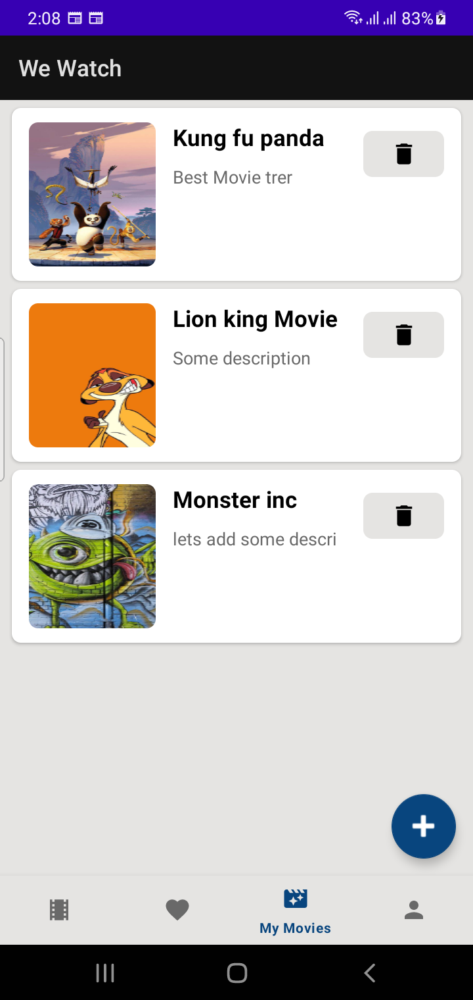
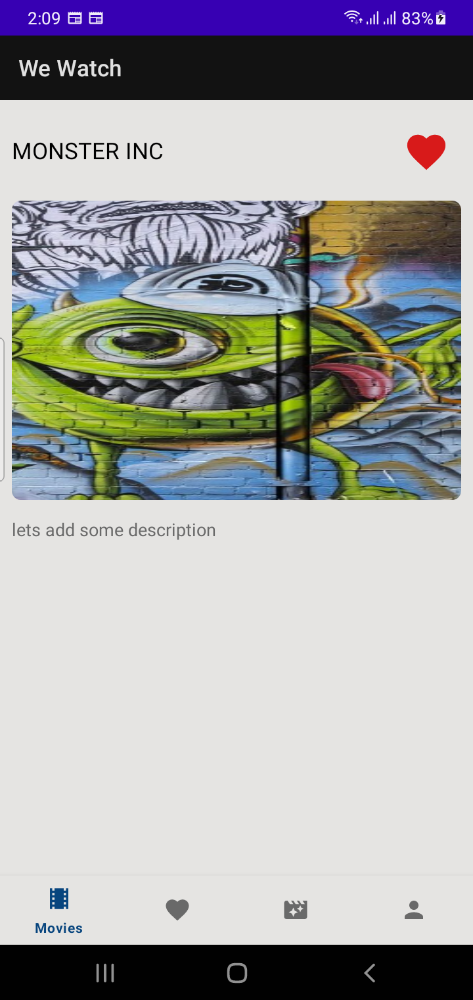

# WeWatch

* Kotlin on the front-end  
    + Use Fragment
    + Room database
    + Retrofit for fetching data from server
    + Caching system using room database
    + Shared preference
+ Ruby on rails on the back-end   
    + Use JWT for user authentication and authorization 
    + Rails Api
* Here are the screen shots   

 

 

